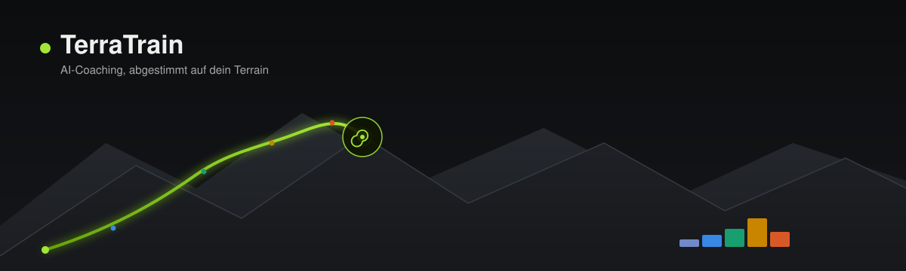
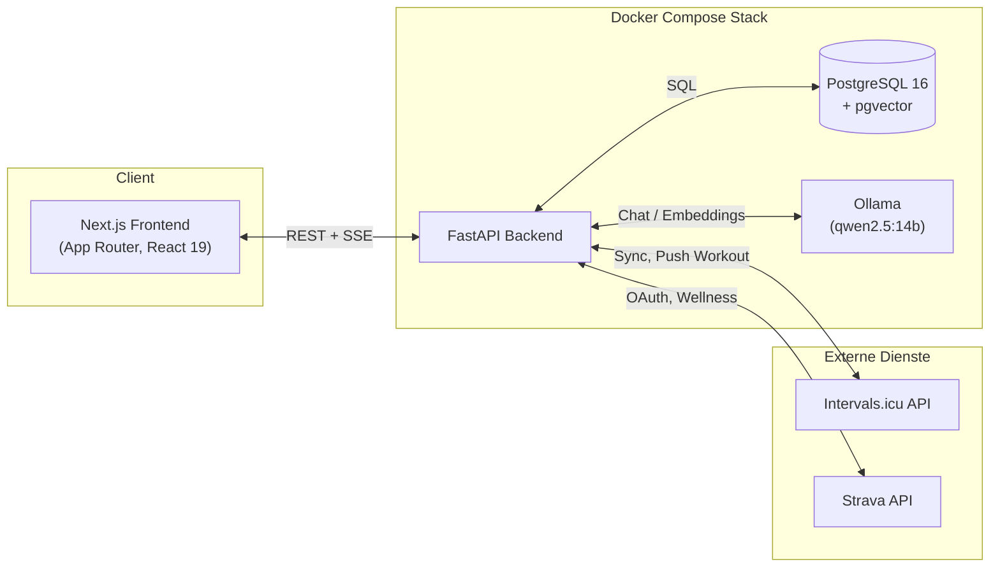

<p align="center">
  
</p>

<p align="center">
  <strong>AI-Coaching, abgestimmt auf dein Terrain.</strong><br>
  TerraTrain verbindet deine echten Trainingsdaten (Intervals.icu / Strava) mit GPX-Streckenanalyse
  und einem lokalen LLM, um dir individuelle, physiologisch geprüfte Workouts zu erstellen —
  komplett selbst gehostet, ohne dass deine Daten irgendwo in die Cloud gehen.
</p>

---

## Inhalt

- [Features](#features)
- [Architektur](#architektur)
- [Schnellstart](#schnellstart)
- [Tech-Stack](#tech-stack)
- [Projektstruktur](#projektstruktur)
- [Weiterführende Dokumentation](#weiterführende-dokumentation)
- [Entwicklung](#entwicklung)

## Features

| | |
|---|---|
| 🧠 **AI Coach** | Lokales LLM (Ollama) generiert strukturierte Workouts als Tool-Use-Agent — mit Validierungs-Schleife gegen physiologisch unrealistische Pläne |
| 📅 **Wochenplaner** | **NEU**: Plant eine komplette Woche mit Mesozyklus-Periodisierung (3:1 oder 2:1), auto-erkennt den aktuellen Zyklusstand via Intervals.icu-TSS und erlaubt beliebig viele Einheiten pro Tag |
| 🗺️ **Terrain-Analyse** | GPX-Upload → automatische Erkennung von Anstiegen (Gradient, VAM, Kategorie) via Polars |
| 📊 **Trainingssteuerung** | CTL/ATL/TSB (Performance Management Chart) aus echten Intervals.icu-Daten, inkl. Fallback auf Intervals.icu-Wellness für Strava-Athleten |
| 📚 **RAG-Wissensbasis** | Trainingswissenschaftliche PDFs hochladen → der Coach zitiert echte Forschung statt nur Modellwissen |
| 🔗 **Intervals.icu-Sync** | Athletenprofil, Trainingshistorie, generierte Workouts — bidirektional |
| 🎯 **Zero-Friction-UX** | Einmal verbinden, nie wieder UUIDs oder curl — alles im Browser |
| 🔒 **100 % lokal** | Postgres, Ollama und die App laufen alle in deinem eigenen Docker-Stack |

## Architektur



Details zum Datenfluss des Coaching-Agenten und zum Datenbankschema: siehe [`docs/architecture.md`](docs/architecture.md).

## Schnellstart

Voraussetzung: Docker Desktop (mit WSL2-Integration falls Windows) und optional eine NVIDIA-GPU.

```bash
git clone <repo-url> TerraTrain && cd TerraTrain
cp env.example .env          # SECRET_KEY und ENCRYPTION_KEY generieren, siehe Kommentare in der Datei

make setup                   # Docker-Services hoch, KI-Modelle laden, DB migrieren
make dev-gpu                  # Stack starten (GPU-Profil für Ollama)
```

Dann **http://localhost:3000** öffnen — die App führt dich durch die Verbindung mit deinem
Intervals.icu-Konto. Kein `curl`, keine UUIDs.

| Ohne GPU? | Befehl |
|---|---|
| CPU-Modell laden | `make pull-models-cpu` (qwen2.5:7b, kleiner & schneller auf CPU) |
| Stack ohne GPU-Profil starten | `make dev` |

Ausführliche Bedienungsanleitung: [`docs/usage.md`](docs/usage.md).

## Tech-Stack

| Ebene | Technologie |
|---|---|
| Backend | Python 3.12, FastAPI, SQLAlchemy 2.0 (async), Alembic |
| Datenverarbeitung | **Polars** (kein pandas) |
| Datenbank | PostgreSQL 16 + **pgvector** |
| KI / LLM | **Ollama** (lokal, `qwen2.5:14b`), LlamaIndex für RAG-Ingestion |
| Frontend | Next.js 15 (App Router), React 19, TypeScript, Tailwind CSS v4 |
| State / Data | zustand, @tanstack/react-query, recharts |
| Paketverwaltung | `uv` (Python), `npm` (Node) |
| Container | Docker Compose |

## Projektstruktur

```
TerraTrain/
├── apps/
│   ├── backend/        FastAPI-App (terratrain-Package), Alembic-Migrationen
│   └── frontend/       Next.js-App (App Router)
├── docker/             Dockerfiles + nginx-Konfiguration
├── docs/               Diese Dokumentation
├── scripts/            Seed-, Ingestion- und Diagnose-Skripte
├── tests/backend/      Unit- und Integrationstests
└── Makefile            Alle Entwickler-Kommandos (siehe `make help`)
```

## Weiterführende Dokumentation

- **[docs/usage.md](docs/usage.md)** — Bedienungsanleitung: Onboarding, Coach, Routen, Workouts, Wissen, Einstellungen
- **[docs/architecture.md](docs/architecture.md)** — Systemarchitektur, Datenbankschema, Coaching-Agent-Ablauf (mit Mermaid-Diagrammen)

## Entwicklung

```bash
make help              # alle verfügbaren Befehle anzeigen
make test               # Backend-Testsuite mit Coverage
make lint               # Ruff
make typecheck          # mypy
make logs                # Logs aller Services verfolgen
```

Weitere Details zu Migrationen, Modell-Wechsel und Wissenschafts-PDFs stehen im
[Makefile](Makefile) (`make help`) und in [`docs/usage.md`](docs/usage.md).
