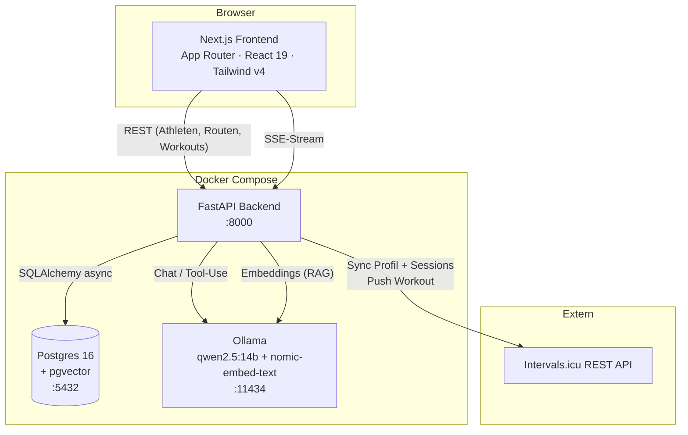
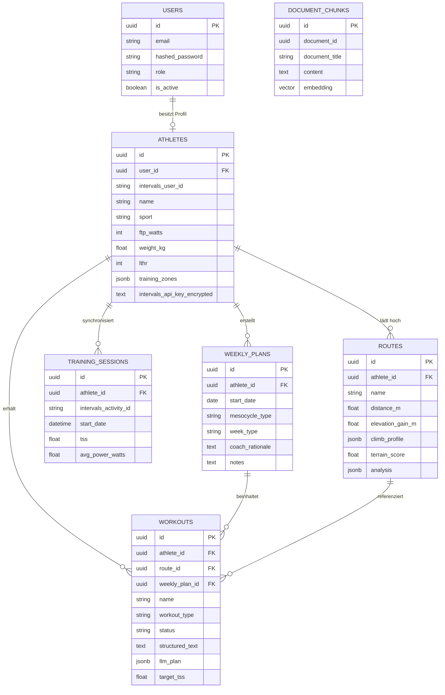
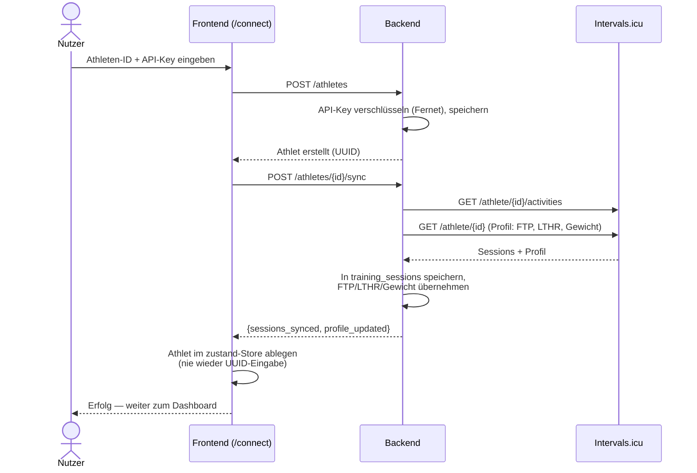
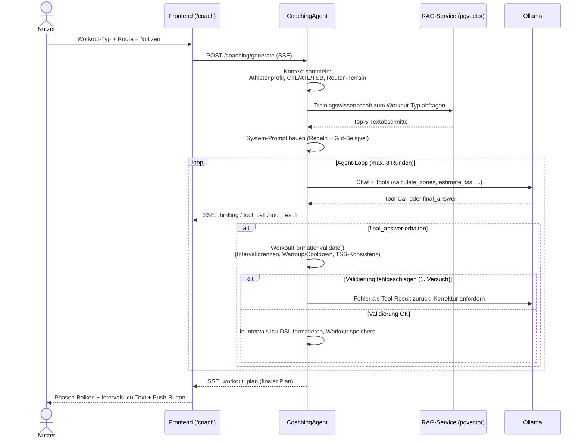

# Architektur

Dieses Dokument beschreibt, wie TerraTrain intern aufgebaut ist: die Service-Landschaft, das
Datenbankschema und die beiden wichtigsten Abläufe — Athleten-Onboarding und der KI-Coaching-Agent.

## Inhalt

- [Service-Landschaft](#service-landschaft)
- [Datenbankschema](#datenbankschema)
- [Ablauf: Athlet verbinden & synchronisieren](#ablauf-athlet-verbinden--synchronisieren)
- [Ablauf: KI-Coaching-Agent](#ablauf-ki-coaching-agent)
- [Physiologische Validierung](#physiologische-validierung)

## Service-Landschaft

Vier Container, orchestriert über `docker-compose.yml` (+ `docker-compose.gpu.yml` für GPU-Beschleunigung):

**Warum lokal und nicht Cloud-LLM?** Trainingsdaten (Leistungswerte, Gesundheitsmetriken) bleiben
auf der eigenen Maschine. `OLLAMA_CHAT_MODEL` ist über eine Env-Var austauschbar — von `qwen2.5:7b`
auf CPU bis `llama3.3:70b` auf potenter GPU-Hardware.

## Datenbankschema

`document_chunks` gehört bewusst zu keinem Athleten — die Wissensbasis (RAG) ist global und speist
jede Coaching-Anfrage.

## Ablauf: Athlet verbinden & synchronisieren

Athleten, deren Aktivitäten über Strava laufen, haben oft leere `training_sessions.tss` (Stravas
API-Bedingungen blockieren Aktivitätsdetails für Drittanbieter). Der Fitness-Endpoint erkennt das
und fällt automatisch auf Intervals.icus eigene CTL/ATL-Werte aus deren `/wellness`-Endpoint zurück
— siehe `services/fitness_service.py`.

## Ablauf: KI-Coaching-Agent

Der Coach ist ein handgeschriebener Tool-Use-Loop (kein LangChain/CrewAI) über Ollamas Chat-API,
mit einer harten Validierungs-Schleife, damit die KI keine physiologisch unmöglichen Workouts
produzieren kann.

## Physiologische Validierung

`WorkoutFormatter.validate()` (`apps/backend/src/terratrain/services/workout_formatter.py`) lehnt
Pläne ab, die diese Regeln verletzen:

| Regel | Grenze |
|---|---|
| Intervalle über 105 % FTP | max. 8 min pro Intervall |
| Schwellenintervalle (95–105 % FTP) | max. 30 min pro Intervall |
| Gesamtzeit ≥ 95 % FTP | max. 60 min pro Einheit |
| Erste Phase | Warmup: ≤ 75 % FTP, ≥ 5 min |
| Letzte Phase | Cooldown: ≤ 75 % FTP |
| Ziel-TSS vs. berechnetes TSS | max. ±30 % Abweichung |

Verstößt ein von der KI generierter Plan gegen eine Regel, bekommt die KI die konkrete Fehlermeldung
als Tool-Ergebnis zurück und darf **einmal** nachbessern, bevor der Stream mit einer Fehlermeldung
endet. Das ist der Fix für den ursprünglichen Fall "4×45 Min bei 100 % FTP".

## Ablauf: KI-Wochenplaner-Agent & Mesozyklus-Erkennung

Der Wochenplaner ([`WeeklyCoachingAgent`](file:///home/winscience/src/github/TerraTrain/apps/backend/src/terratrain/services/weekly_coaching_agent.py)) koordiniert die Erstellung eines periodisierten Wochenplans:

1. **Mesozyklus-Erkennung ([`MesocycleDetector`](file:///home/winscience/src/github/TerraTrain/apps/backend/src/terratrain/services/mesocycle_detector.py))**:
   - Berechnet die wöchentliche TSS-Summe der letzten 4 Wochen aus den importierten Aktivitätsdaten (`TRAINING_SESSIONS`).
   - Schlägt basierend auf Periodisierungs-Zyklen (`3-1` oder `2-1`) und dem Belastungsverlauf den Wochentyp vor (z. B. Erholungswoche, falls 3 Wochen progressive TSS-Belastung vorausgingen).
2. **Generierungs-Loop**:
   - Sendet den gesamten Wochenplanentwurf (ausgewählte Wochentage, GPX-Routen, Zieldauern) an das LLM.
   - Das LLM liefert über ein strukturiertes JSON-Schema alle Workouts der Woche in einem einzigen Tool-Call zurück.
   - Der Agent führt für jedes generierte Workout die physiologische Validierungsprüfung ([`WorkoutFormatter.validate`](file:///home/winscience/src/github/TerraTrain/apps/backend/src/terratrain/services/workout_formatter.py)) durch und fordert im Fehlerfall Nachbesserung an.
   - Nach erfolgreicher Validierung werden der `WeeklyPlan` sowie die einzelnen `Workout`-Einträge in der PostgreSQL-Datenbank abgelegt.

