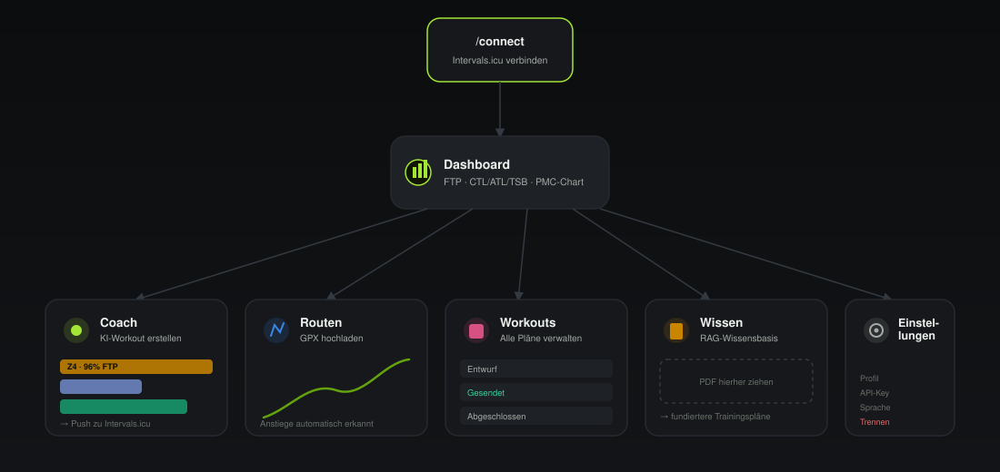

# Bedienungsanleitung

So benutzt du TerraTrain — vom ersten Start bis zum ersten KI-generierten Workout.

<p align="center">
  
</p>

## Inhalt

- [1. Erststart](#1-erststart)
- [2. Mit Intervals.icu verbinden](#2-mit-intervalsicu-verbinden)
- [3. Dashboard](#3-dashboard)
- [4. Routen hochladen](#4-routen-hochladen)
- [5. Ein Workout vom AI Coach erstellen](#5-ein-workout-vom-ai-coach-erstellen)
- [6. Workouts verwalten](#6-workouts-verwalten)
- [7. Wissensbasis füttern (RAG)](#7-wissensbasis-füttern-rag)
- [8. Einstellungen](#8-einstellungen)
- [Problembehandlung](#problembehandlung)

## 1. Erststart

```bash
make setup      # einmalig: .env anlegen, Docker-Services hoch, KI-Modelle laden, DB migrieren
make dev-gpu    # Stack starten (mit GPU-Beschleunigung für Ollama)
```

Ohne GPU: `make pull-models-cpu` statt `pull-models-gpu`, und `make dev` statt `make dev-gpu`.

Öffne danach **http://localhost:3000**. Ohne verbundenen Athleten leitet dich die App automatisch
zur Verbinden-Seite weiter — es gibt keine UUID-Eingabe mehr, an keiner Stelle der App.

## 2. Mit Intervals.icu verbinden

Auf `/connect` brauchst du zwei Werte von deinem Intervals.icu-Konto:

1. Öffne **https://intervals.icu/settings** → Abschnitt *Developer Settings*
2. Kopiere deine **Athleten-ID** (Format `i123456`)
3. Erzeuge (falls noch nicht vorhanden) einen **API-Key**

Trage beides zusammen mit Name und Sportart ins Formular ein und klicke **Verbinden**. TerraTrain
erstellt den Athleten, synchronisiert automatisch die letzten 90 Tage Trainingshistorie und zeigt
dir zur Bestätigung FTP, Gewicht und die Anzahl importierter Einheiten.

> Der API-Key wird verschlüsselt (Fernet) in der Datenbank abgelegt, nie im Klartext.

## 3. Dashboard

Die Startseite zeigt:

- **FTP, Gewicht, CTL, ATL** als Kacheln
- **Form (TSB)** mit einer Bandanzeige zwischen "sehr ermüdet" und "frisch"
- **Leistungsentwicklung** — ein 90-Tage-PMC-Chart (Fitness/Ermüdung/Form) aus deinen echten
  Trainingsdaten
- **Letzte Workouts** mit Status-Badges

> Wenn deine Aktivitäten über Strava laufen: Strava blockiert Aktivitätsdetails für
> Drittanbieter-Apps. TerraTrain erkennt das und lädt stattdessen die von Intervals.icu selbst
> berechneten CTL/ATL-Werte nach — dein Chart bleibt trotzdem korrekt.

## 4. Routen hochladen

Auf `/routes`: GPX-Datei per Drag & Drop oder Klick hochladen. TerraTrain analysiert die Strecke
sofort:

- Distanz, Höhenmeter, Terrain-Score (0 = flach, 1 = sehr hügelig)
- Automatisch erkannte Anstiege mit Gradient, VAM und Kategorie (Cat 4 bis HC)

Diese Anstiege kann der AI Coach gezielt für Intervalle nutzen (siehe nächster Schritt).

## 5. Ein Workout vom AI Coach erstellen

Auf `/coach`:

1. **Trainingsart** wählen (Grundlage, Tempo, Schwelle, VO2max, Erholung, Rennsimulation)
2. Optional: **Datum** und eine hochgeladene **Route** auswählen
3. Optional: **Hinweise** (z. B. "nur 45 Minuten Zeit")
4. **Workout erstellen** klicken

Du siehst live, was der Coach tut — Zwischengedanken und Tool-Aufrufe (Zonen berechnen, TSS
schätzen, Trainingswissenschaft nachschlagen) laufen im Stream-Panel durch. Das fertige Workout
erscheint als Karte mit:

- Zonenfarbigen **Phasen-Balken** (Breite ∝ Dauer, Zonen-Code immer als Text sichtbar)
- Der Begründung des Coaches (warum genau dieses Workout, bezogen auf deine aktuelle Form)
- Dem fertigen Intervals.icu-Text zum Kopieren
- Einem **"Zu Intervals.icu senden"**-Button

Jeder generierte Plan durchläuft eine automatische Plausibilitätsprüfung (siehe
[`docs/architecture.md`](architecture.md#physiologische-validierung)) — unrealistische Intervalle
wie "4×45 Minuten bei 100 % FTP" werden abgelehnt, bevor du sie überhaupt siehst.

## 6. Workouts verwalten

Auf `/workouts` findest du alle bisher generierten Pläne mit Status (Entwurf, Gesendet,
Abgeschlossen …). Den Intervals.icu-Text kannst du einklappen/aufklappen und noch nicht gesendete
Entwürfe direkt von hier aus pushen.

## 7. Wissensbasis füttern (RAG)

Auf `/knowledge` lädst du Trainings­wissenschaft als PDF hoch (Drag & Drop, mehrere Dateien
möglich). Jedes PDF wird in Textabschnitte zerlegt, eingebettet und in der Vektordatenbank
gespeichert — das dauert etwa 30–60 Sekunden pro Datei.

Der Coach zieht diese Abschnitte automatisch bei jeder Anfrage heran (z. B. "polarisiertes
Training" bei einem Grundlage-Workout). Mit der **Suche testen**-Box kannst du selbst prüfen, was
der Coach zu einem Thema findet, inklusive Relevanz-Score.

Dokumente lassen sich jederzeit wieder löschen (Papierkorb-Symbol in der Liste).

## 8. Einstellungen

Auf `/settings`:

- **Profil**: Name, Sportart, FTP, Gewicht, LTHR, Herzfrequenzwerte anpassen
- **Intervals.icu**: neuen API-Key hinterlegen, manuell neu synchronisieren
- **Sprache**: Deutsch/Englisch umschalten
- **Gefahrenzone**: Verbindung trennen (löscht den Athleten und alle zugehörigen Daten unwiderruflich)

## Problembehandlung

| Symptom | Ursache | Lösung |
|---|---|---|
| "network error" beim Workout erstellen | KI-Modell nicht geladen | `make pull-models-gpu` (oder `-cpu`) ausführen |
| `make dev-gpu` schlägt mit Docker-Fehler fehl | Docker Desktop läuft nicht | Docker Desktop starten, WSL2-Integration prüfen |
| Dashboard zeigt CTL/ATL = 0 | Noch keine Sessions synchronisiert | Auf `/settings` → **Neu synchronisieren** klicken |
| Workout wird abgelehnt ("Validation failed") | Physiologisch unrealistischer Plan | Normalverhalten — der Coach bekommt die Fehlermeldung und bessert automatisch einmal nach |
